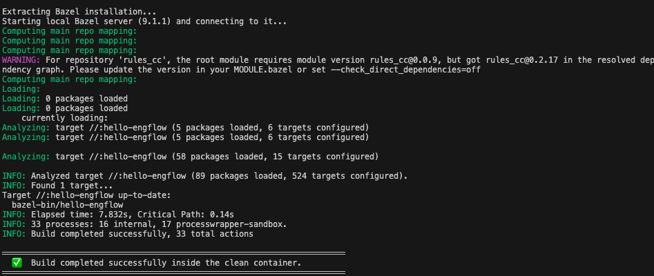

# Bazel "It works on my machine!" Simulation

This project  **fixes** a  common migration to Bazel issue: a **non-hermetic system library dependency** that compiles on a developer's laptop but fails on remote build workers.

---

## The Issue

The main.cpp C++ program  includes `<zlib.h>` and links to the library via `-lz` in BUILD file:

```cpp
#include <zlib.h>  // ← System header — non-hermetic!
```

On the developer's laptop, `zlib` is typically available. But on a **clean remote worker**, these headers don't exist. The build fails with:

```
src/main.cpp:12:10: fatal error: zlib.h: No such file or directory
   12 | #include <zlib.h>
      |          ^~~~~~~~
```

---

## Methodology

### 1. Reproduce the Failure

Run these commands to see the difference between your local host environment and the sterile remote environment:

```bash
cd bazel-remote-sandbox

# Step 1: Build locally — should SUCCEED (using local host system zlib)
bazel build //...
bazel run //:hello-engflow

# Step 2: Build in the clean container — should FAIL (no system zlib available)
./run_clean_build.sh
```

### 2. Apply the Hermetic Fix

To resolve the error, we configure Bazel to fetch and compile the dependency hermetically:

1. **`MODULE.bazel`** — Add `bazel_dep(name = "zlib", version = "1.3.2")` to declare `zlib` via the Bazel Central Registry.
2. **`BUILD`** — Replace `linkopts = ["-lz"]` with `deps = ["@zlib"]` to link against the hermetic target.

Now, run the build again in the clean container — it will succeed:

```bash
./run_clean_build.sh
```

#### Results
When the hermetic dependency fix is active, the build compiles successfully even on sterile environments:



---

## 📁 File Structure

```
bazel-remote-sandbox/
├── MODULE.bazel              # Bzlmod config (declares zlib dependency from BCR)
├── BUILD                     # Build target (compiles hello-engflow linking against @zlib)
├── .bazelrc                  # Bazel configuration settings
├── src/
│   └── main.cpp              # C++ source code utilizing zlib compression
├── Dockerfile.clean-runner   # Clean Ubuntu container simulating build machine
└── run_clean_build.sh        # Runner script to compile inside Docker container
```